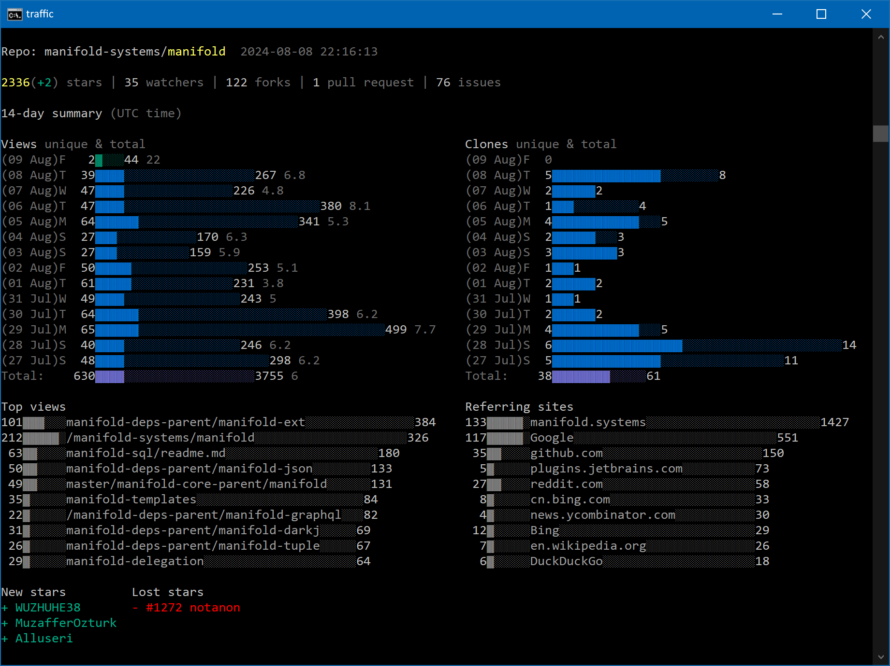

# GitHub traffic CLI

Use this command line interface (CLI) tool to produce a textual GitHub traffic report for any repository. The report is
similar in format to GitHub's Traffic page, but with includes additional features such as star diffs between usages, who
starred/unstarred the repo, unique view ratio per top views. See the example below. 

# Build
  
### Requirements
- [Maven](https://maven.apache.org/)
- JDK 8 or later

### Command line

From the project root directory:
```
mvn package
```
This will produce an executable JAR file in the ./target directory.

# Usage

### Requirements
- Java 8 or later

> Ensure a JVM 8 or greater is on your execution path.

Use the included shell script to run the GitHub traffic CLI tool.
- `traffic` for Unix/Mac
- `traffic.bat` for Windows

Example:
```
traffic -user joeuser -repo joeswidget -token xxxxxxxxxxxxxxxxxxxxxxxxxxxxxxxxxxxxxxxx
```

#### Required parameters:

`-user`: Github user/org name

`-repo`: Github repository name

`-token`: Github authorization token

#### Optional parameters:

`-days`: Number of days to display. Values may range from 1..14. Default is 14.

# Sample report

